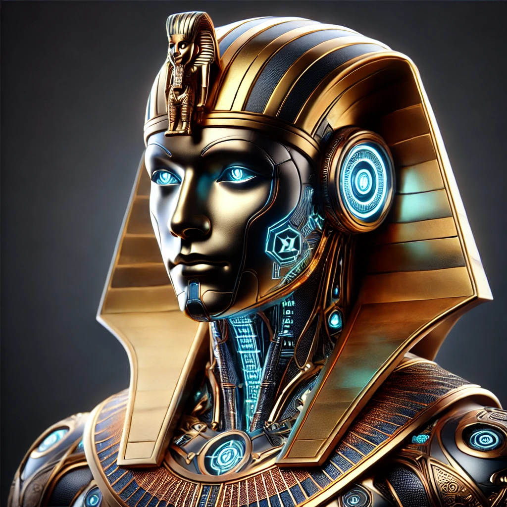

# Ramses - Voice Conversation AI Assistant 🎙️



> A voice-based AI assistant that turns your conversations into seamless interactions using offline speech recognition and local LLM capabilities.

## ✨ Features

- 🎤 Real-time voice detection with WebRTC VAD
- 🤖 Offline speech recognition using faster-whisper
- 🧠 Local LLM processing via Ollama
- 🗣️ Natural speech synthesis with Kokoro TTS
- 💭 Contextual memory for natural conversations

## 🚀 Quick Start

### Prerequisites

- Python 3.12
- [Ollama](https://ollama.ai) installed locally
- Microphone and speakers
- 8GB+ RAM

### Installation

```bash
# Clone the repository
git clone https://github.com/rodgersmag/Ramses---Uncensored-Voice-Assistant-Your-Voice-Your-Rules
cd Ramses---Uncensored-Voice-Assistant-Your-Voice-Your-Rules

# Set up virtual environment
python -m venv venv312
source venv312/bin/activate  # Windows: venv312\Scripts\activate

# Install dependencies
pip install -r requirements.txt

# Download the LLM model
ollama pull goekdenizguelmez/JOSIEFIED-Qwen2.5:3b
```

## Usage

1. Ensure Ollama is running on your machine

2. Run the application:
   ```
   python main.py
   ```

3. Start speaking to the assistant. The application will:
   - Listen for your voice input
   - Process your query with the LLM
   - Respond with synthesized speech

4. To exit the conversation, say "goodbye" or "bye".

## How It Works

- **Speech Recognition**: Uses WebRTC Voice Activity Detection (VAD) to capture speech and offline faster-whisper for transcription.
- **Language Processing**: Utilizes a local LLM through Ollama to process queries and generate responses.
- **Text-to-Speech**: Converts responses to natural-sounding speech using the Kokoro-82M model with voice "af_heart".
- **Conversation Context**: Maintains conversation history to provide contextually relevant responses.

## Key Components

- **VAD**: Detects when speech is occurring to efficiently capture audio
- **PyAudio**: Handles audio input/output
- **Speech Recognition**: Converts speech to text
- **Ollama**: Provides local LLM inference
- **Kokoro TTS**: Generates natural-sounding speech
- **PyGame**: Plays audio responses

## 🤝 Contributing

Contributions are what make the open source community amazing! Any contributions you make are **greatly appreciated**.

1. Fork the Project
2. Create your Feature Branch (`git checkout -b feature/AmazingFeature`)
3. Commit your Changes (`git commit -m 'Add some AmazingFeature'`)
4. Push to the Branch (`git push origin feature/AmazingFeature`)
5. Open a Pull Request

### Areas We Need Help With

- 🐛 Bug fixes and issue reporting
- ✨ New features and improvements
- 📚 Documentation improvements
- 🧪 Testing and test coverage
- 🎨 UI/UX improvements

## 🔧 Troubleshooting

<details>
<summary>Common Issues and Solutions</summary>

- **Microphone not working?** Check your system's audio input settings
- **LLM not responding?** Ensure Ollama is running with `ollama serve`
- **Speech recognition issues?** Try a quieter environment
- **TTS problems?** Verify Kokoro model installation

</details>

## Technical Details

The application uses several threading mechanisms to handle concurrent operations:
- Audio playback runs in a separate thread
- TTS generation for multi-sentence responses is parallelized
- Speech recognition with VAD runs in the main thread during conversation

The application leverages multi-threading to manage audio playback, TTS generation, and speech recognition concurrently. It also implements signal handling for graceful termination.

## 📜 License

Distributed under the AS IS License. See `LICENSE` for more information.

Permission is hereby granted, free of charge, to any person obtaining a copy of this software and associated documentation files (the "Software"), to use, copy, modify, merge, publish, distribute, sublicense, and/or sell copies of the Software, subject to the following conditions:

THE SOFTWARE IS PROVIDED "AS IS", WITHOUT WARRANTY OF ANY KIND, EXPRESS OR IMPLIED, INCLUDING BUT NOT LIMITED TO THE WARRANTIES OF MERCHANTABILITY, FITNESS FOR A PARTICULAR PURPOSE, AND NONINFRINGEMENT. IN NO EVENT SHALL THE AUTHORS OR COPYRIGHT HOLDERS BE LIABLE FOR ANY CLAIM, DAMAGES, OR OTHER LIABILITY, WHETHER IN AN ACTION OF CONTRACT, TORT OR OTHERWISE, ARISING FROM, OUT OF, OR IN CONNECTION WITH THE SOFTWARE OR THE USE OR OTHER DEALINGS IN THE SOFTWARE. The user is solely responsible for any outcomes or issues that arise from the use of this Software.


## 🙏 Acknowledgments

- [Ollama](https://ollama.ai) - Local LLM inference
- [fast-whisper](https://github.com/guillaumekln/faster-whisper) - Speech recognition
- [Kokoro](https://github.com/hexgrad/kokoro) - Text-to-speech
- [Goekdeniz-Guelmez](https://huggingface.co/Goekdeniz-Guelmez/Josiefied-Qwen2.5-3B-Instruct-abliterated-v1-gguf) - LLM
---

<div align="center">

⭐ Star us on GitHub — it motivates us to make great open source tools!

</div>
